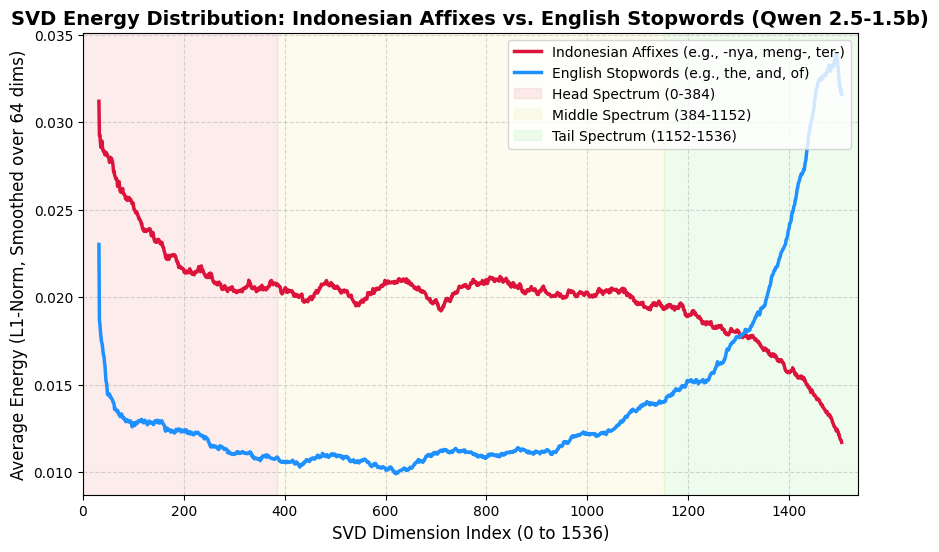
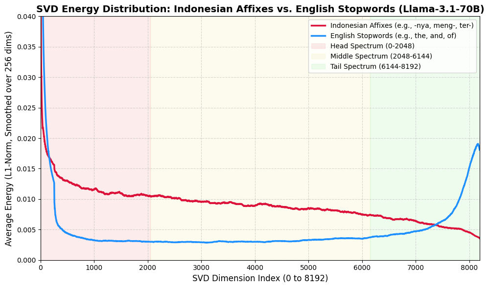

# Less is More: Boosting Multilingual Retrieval Performance through SVD-Based Semantic Compression
**Why Head Spectrum Retention Outperforms English-Centric SVD Filtering for Indonesian Retrieval**

Fahmi Alfayadh  
25 June 2026

## Abstract
The utilization of Decoder-Only Large Language Models (LLMs) as generative embedders is increasingly researched, with recent work demonstrating the effectiveness of instruction-tuned causal LLMs via Last-Token Pooling. Post-hoc representation refinement techniques like EmbFilter discard extreme singular value components (the edge spectrum) of the unembedding matrix to remove noise. However, EmbFilter assumes the head spectrum contains only stopword noise — an assumption that remains untested for agglutinative languages, where standard subword tokenizers fragment bound morphemes into semantically opaque subwords, causing their spectral behavior to differ fundamentally from English stopwords. This study proposes an L2-norm profiling algorithm to evaluate the energy distribution of Indonesian affixes across the SVD spectrum of Qwen2.5 and Llama-3.1 models. We demonstrate that critical Indonesian affixes concentrate the vast majority of their semantic energy in the head and middle spectra. Based on these findings, we propose a shifted retention window configuration (Indonesian-Retention, covering indices 0–767). Evaluated in a zero-shot, unsupervised setting, this approach compresses representations by 50% while significantly improving NDCG@10 from a baseline of 0.1592 to 0.2900 on the Indonesian MIRACL retrieval task.

---

## 1. Background
The utilization of Decoder-Only Large Language Models (LLMs) as generative embedders is increasingly researched, with models such as E5-Mistral (Wang et al., 2023) and GritLM (Muennighoff et al., 2024) repurposing causal LLMs via instruction tuning and Last-Token Pooling. However, this approach inherits the geometric biases of the Next-Token Prediction (NTP) objective, producing anisotropic semantic spaces where cosine similarity is distorted by token frequency biases — degrading performance in Information Retrieval (IR) and Retrieval-Augmented Generation (RAG) tasks.

Post-hoc representation refinement offers an alternative without retraining. Chen et al. (2026) demonstrated that SVD decomposition of the unembedding matrix reveals a structured spectrum: the Head Spectrum captures high-frequency stopword noise, while the Tail captures rare tokens. Their EmbFilter method discards both extremes, projecting vectors onto the remaining middle dimensions.

Although effective in English, EmbFilter assumes the Head Spectrum universally contains stopword noise — an assumption untested for agglutinative languages. BPE tokenizers fragment bound morphemes of such languages into semantically opaque subwords (Bostan et al., 2023), causing them to behave differently from English stopwords in the SVD spectrum. This study tests that assumption for Indonesian and proposes a retention window adapted to its morphological energy distribution.

---

## 2. Algorithm and Methodology
This study implements a linear-algebra-based orthogonal projection filter in accordance with the EmbFilter framework, applied to the Qwen2.5-1.5B model ($d=1536$).

### 2.1. Unembedding Matrix Decomposition
The unembedding matrix (defined as `lm_head.weight` in Qwen architectures) is represented as $W \in \mathbb{R}^{|V| \times d}$, where $|V|$ is the vocabulary size and $d$ is the latent dimension. The matrix $W$ is fully decomposed using Singular Value Decomposition (Full SVD) without truncation:

$$W = U \Sigma V^T$$

where $U$ is the left singular matrix, $\Sigma$ is the diagonal matrix of singular values sorted in descending order, and $V^T \in \mathbb{R}^{d \times d}$ is the transposed right singular matrix. Because $\Sigma$ is sorted in descending order, the top rows of $V^T$ correspond to the largest singular values (the Head Spectrum), and the bottom rows correspond to the smallest singular values (the Tail Spectrum).

### 2.2. L2-Norm Profiling-Based Retention Window Shifting Algorithm
For a $2\times$ compression ratio, the target dimension is $d' = 1536/2 = 768$. Rather than adopting the default truncation range from the reference paper, we developed a latent energy profiling algorithm to determine the optimal range empirically. The algorithm operates in three stages: extracting the `lm_head` matrix and performing a Full SVD, projecting each token’s row vector onto three spectral zones (Head Top 25%, Middle Mid 50%, Tail Bottom 25%), then computing the squared magnitude of energy (projective L2-norm) to detect where each token’s semantic information is concentrated. The resulting vocabulary distribution mapping is presented in Table 1.

**Table 1: Vocabulary Distribution by Spectrum Zone**

| Spectrum Zone | Dimension Range | Primary Characteristics | Token Examples |
|:---|:---:|:---|:---|
| **Head Spectrum** | Top 25% | High cross-document variance; dominated by structural markers, non-Latin scripts, and code/HTML elements | `'أوضاع'` (Arabic), `'낡'` (Korean), `"\n\n\n\n"`, `'<//'` |
| **Middle Spectrum** | Middle 50% | Morphological tokens and affixes; bound morphemes, word-forming suffixes | `'edly'`, `'ingly'`, `'lessly'`, `' herself'`, `'为空'` |
| **Tail Spectrum** | Bottom 25% | High frequency, low cross-context variance; common particles across multiple languages | `' they'`, `' about'`, `' its'`, `'他们'`, `'a'`, `'\n'`, `'<\|endoftext\|>'` |

The distribution in Table 1 reveals findings that challenge the reference paper’s assumptions. The Tail Spectrum is dominated by English/Mandarin stopwords, single characters, and structural tokens that appear constantly across all texts with near-zero variance, confirming that these dimensions largely contain anisotropic noise. The Head Spectrum, on the other hand, houses language identity markers such as non-Latin scripts and multilingual elements, contrary to EmbFilter’s assumption that this zone contains only stopword frequency noise. This finding raises a critical question: how is the energy of Indonesian morphological tokens distributed across the SVD spectrum?

To answer this question, we analyzed the L2-norm distribution of 12 key Indonesian affixation tokens, encompassing suffixes (`-nya`, `-lah`, `-kan`, `-pun`, `-kah`, `-ku`, `-mu`) and prefixes (`di-`, `ter-`, `ber-`, `meng-`, `mem-`). The results are presented in Table 2.

**Table 2: L2-Norm Distribution of Indonesian Affixes (Qwen2.5-1.5B)**

| Affix Token | Head Spectrum (Top 25%) | Middle Spectrum (Mid 50%) | Tail Spectrum (Bot 25%) |
|:---|:---:|:---:|:---:|
| `'nya'` | 35.0% | **37.6%** | 27.4% |
| `'lah'` | 35.7% | **39.6%** | 24.7% |
| `'kan'` | 36.0% | **40.3%** | 23.7% |
| `'pun'` | 38.5% | **39.5%** | 22.1% |
| `'kah'` | **38.5%** | 38.4% | 23.1% |
| `'ku'` | 37.4% | **41.4%** | 21.2% |
| `'mu'` | 39.3% | **39.4%** | 21.3% |
| `' di'` | 28.8% | **45.2%** | 25.9% |
| `' ter'` | 32.7% | **44.7%** | 22.6% |
| `' ber'` | 33.5% | **42.3%** | 24.2% |
| `' meng'` | 35.2% | **40.6%** | 24.2% |
| `' mem'` | 38.9% | **41.8%** | 19.2% |

The critical affix tokens accumulate **75% to 80%** of their total latent energy in the combined Head and Middle Spectrum, sharply contrasting with English stopwords concentrated in the Tail. Figure 1 visualizes this localization difference through the average SVD energy distribution (L1-norm) for both token groups across the entire 1536-dimension spectrum, smoothed with a moving window of size 64.

The curves in Figure 1 visually confirm what the quantitative data show: English stopword energy peaks in the Middle and Tail spectra but drops sharply in the Head, while Indonesian affix energy peaks sharply in the Head Spectrum (dimensions 0–384). This pattern directly explains why the English-Middle filter, which discards the first 25% of the spectrum, degrades Indonesian semantic representations by eliminating the region with the highest affix energy concentration.

### 2.3. Cross-Model and Cross-Architecture Generalizability Validation
The morphological energy concentration in the Head Spectrum identified on Qwen2.5-1.5B requires verification: is this a universal linguistic characteristic, or merely an artifact of one particular architecture and model scale? We tested the generalizability of this finding on two additional models that differ significantly in scale and architecture.

The first test was conducted on **Qwen2.5-7B** (3,584 latent dimensions) to verify consistency at a larger scale within the same architecture family. Table 3 shows that the energy distribution pattern remains consistent: the Head and Middle ranges jointly accumulate ~75% to 88% of the total semantic energy of Indonesian affixes, while the Tail portion remains minimal (11–21%).

**Table 3: L2-Norm Distribution of Indonesian Affixes (Qwen2.5-7B)**

| Affix Token | Head Spectrum (0-25%) | Middle Spectrum (25-75%) | Tail Spectrum (75-100%) |
|:---|:---:|:---:|:---:|
| `'nya'` | 33.6% | **45.0%** | 21.4% |
| `'lah'` | 38.4% | **46.3%** | 15.3% |
| `'kan'` | 37.4% | **49.8%** | 12.9% |
| `'pun'` | 38.7% | **49.0%** | 12.3% |
| `' meng'`| 32.6% | **50.5%** | 16.9% |
| `' ber'` | 29.9% | **55.4%** | 14.7% |
| `' ter'` | 38.1% | **50.7%** | 11.1% |

The second test extended the analysis to a completely different architecture: **Llama-3.1-70B** ($d=8192$), with a tokenizer and vocabulary structure entirely separate from the Qwen family. Table 4 shows that even at 70 billion parameters, Indonesian bound morphemes continue to deposit the majority of their semantic energy into the Head and Middle spectra, with an even smaller Tail portion (7–12%) compared to both Qwen models.

**Table 4: L2-Norm Distribution of Indonesian Affixes (Llama-3.1-70B)**

| Affix Token | Head Spectrum (0-25%) | Middle Spectrum (25-75%) | Tail Spectrum (75-100%) |
|:---|:---:|:---:|:---:|
| `'nya'` | 43.1% | **45.6%** | 11.4% |
| `'lah'` | **45.8%** | 44.0% | 10.2% |
| `'kan'` | **48.5%** | 43.8% | 7.7% |
| `'pun'` | **48.9%** | 42.8% | 8.2% |
| `' meng'` | 42.4% | **45.4%** | 12.2% |
| `' ber'` | 35.1% | **54.6%** | 10.3% |
| `' ter'` | 37.4% | **52.4%** | 10.2% |

The L1-norm energy curve for Llama-3.1-70B (Figure 2) reinforces these findings visually. Despite the spectrum spanning 8192 dimensions, the same structural pattern reproduces: English stopwords peak in the Tail, while Indonesian affixes peak sharply in the Head and maintain elevated variance throughout the Middle.

The consistency of this pattern across three models (1.5B, 7B, 70B) and two architecture families (Qwen, Llama) indicates that morphological energy concentration in the Head Spectrum reflects how multilingual LLMs represent bound morphemes in the latent space, rather than being a technical artifact of any single architecture. This phenomenon is relevant to the entire family of agglutinative languages (Turkish, Finnish, Hungarian, Korean, Japanese) that construct grammatical relationships through sequential attachment of bound morphemes. In LLMs trained on joint vocabularies, these bound morphemes have high document frequency and low contextual variance, causing them to project strongly onto the highest singular components.

### 2.4. Projection Configuration
Empirical evidence from all three models demonstrates that the English-Middle approach discards **28% to 38% of the semantic energy** (L2-norm) from essential Indonesian syntactic particles such as the prefixes `meng-`, `ter-`, and the suffixes `-nya`, `-lah`. Our proposed algorithm shifts the retention window (50% compression) to the dimension range 0 to 768, encompassing the entire Head Spectrum and the upper half of the Middle Spectrum (Indonesian-Retention). This shift preserves morphological features while eliminating noise components in the Tail Spectrum.

Four projection matrix configurations $V_{sub} \in \mathbb{R}^{d' \times d}$ were evaluated:

**Table 5: Projection Matrix Configurations**

| Configuration | Description | Index Range of $V_{sub}$ |
|:---|:---|:---|
| **Baseline** | No truncation; the original vector $x \in \mathbb{R}^{1536}$ is used directly | — |
| **English-Middle** | Discards 25% Head and 25% Tail (the reference paper’s approach) | Indices 384–1151 |
| **Indonesian-Retention** | Retains 50% of the Head and Middle spectra (based on the profiling algorithm) | Indices 0–767 |
| **Tail-Retention** | Retains 50% of the Tail spectrum | Indices 768–1535 |

### 2.5. Representation Projection
To filter the representation, we define a truncated projection matrix $V_{sub} \in \mathbb{R}^{d' \times d}$, which retains only the rows corresponding to our target spectral indices. Each sentence is encoded into an initial representation $x \in \mathbb{R}^d$ using Last-Token Pooling. The filtered, compressed vector $x' \in \mathbb{R}^{d'}$ is obtained via orthogonal projection: 
$$x' = x V_{sub}^T$$
This multiplication effectively filters out the discarded spectral dimensions while mapping the original vector into the new condensed subspace, which is subsequently used to compute cosine similarity.

---

## 3. Experimental Results

### 3.1. Evaluation Setup
**Datasets:**

**Table 6: Dataset Descriptions for Evaluation**

| Task | Dataset | Split | Description |
|:---|:---|:---|:---|
| Retrieval (RAG) | MIRACL — Indonesian | dev | 500 random queries; 4,543 positive docs + 5,000 sampled negative docs |

The performance of the projected semantic spaces was measured using two standard information retrieval metrics. **NDCG@10** (Normalized Discounted Cumulative Gain at top 10 candidates) measures retrieval effectiveness by accounting for the position of relevant documents in the results list; it penalizes cases where relevant documents appear lower in the rankings, making it the most critical metric for RAG systems sensitive to context ordering. **Recall@100** measures the percentage of relevant documents successfully retrieved within the top 100 results, indicating how well the vectors can locate correct documents within a large corpus.

The significance of differences between methods was evaluated using a Paired Student’s t-test with a threshold of $\alpha=0.01$ using the `ranx` metrics library.

### 3.2. Main Results
Table 7 summarizes the average performance of each configuration evaluated on the MIRACL Indonesian retrieval task.

**Table 7: Average Performance on MIRACL Indonesian Retrieval Task**

| Configuration | Dimensions | NDCG@10 | Recall@100 |
|:---|:---:|:---:|:---:|
| Baseline | 1536 | 0.1592 | 0.4211 |
| English-Middle | 768 | 0.2333 | 0.6034 |
| Indonesian-Retention | 768 | **0.2900** | **0.6535** |
| Tail-Retention | 768 | 0.0808 | 0.2485 |

The Indonesian-Retention configuration achieved the highest NDCG@10 (0.2900) and Recall@100 (0.6535), surpassing all other configurations including the full-dimensional Baseline vector. Conversely, Tail-Retention produced the lowest performance (NDCG@10 = 0.0808), even below Baseline, confirming that the Tail zone is dominated by noise components.

### 3.3. Statistical Significance Test
To ensure the performance differences are not statistical artifacts, we conducted a Paired Student’s t-test at $\alpha=0.01$:
**Table 8: Paired Student's t-test Results for Significance**

| # | Model | NDCG@10 | Recall@100 |
|:---|:---|:---|:---|
| a | run_baseline | 0.159ᵈ | 0.421ᵈ |
| b | run_english_middle | 0.233ᵃ,ᵈ | 0.603ᵃ,ᵈ |
| c | run_indonesian_retention | 0.290ᵃ,ᵇ,ᵈ | 0.654ᵃ,ᵇ,ᵈ |
| d | run_tail_retention | 0.081 | 0.248 |

*Note: Superscripts denote significant differences ($p<0.01$) against the model index in the corresponding row.*

The superscript notation indicates that the model in that row statistically significantly ($p<0.01$) outperforms the model with the corresponding index. The Indonesian-Retention configuration (c) with notation `0.290ᵃ,ᵇ,ᵈ` outperforms all other configurations absolutely and conclusively on both metrics.

---

## 4. Discussion
The experimental results present strong evidence against the core assumption of the reference paper when the method is applied to a multilingual LLM for an Indonesian corpus task. In Chen et al.'s evaluation on English (Chen et al., 2026), the English-Middle configuration was assumed optimal because the Head Spectrum was considered to solely contain distortions from high-frequency stopwords. This experiment demonstrates the opposite: Indonesian-Retention, which retains the Head, achieves an NDCG@10 of 0.2900, outperforming English-Middle by +24.3% with statistical significance ($p<0.01$). This jarring theoretical clash raises a critical question: is Chen et al. empirically wrong? The profiling data suggests that they are not necessarily wrong for English, but rather that the spectral distribution of noise fundamentally inverts when moving from an English-only vocabulary to a multilingual joint vocabulary. In a multilingual setting, structural markers and cross-lingual identity tokens dominate the high-variance Head, pushing common English stopwords into the low-variance Tail.

The advantage of Indonesian-Retention can be explained through the energy distribution mechanism identified in the profiling analysis. Indonesian encodes grammatical information through bound affixes (`meng-`, `ber-`, `-kan`, `-nya`) that fundamentally determine syntactic and semantic function. BPE-based tokenizers systematically produce fragmented tokenizations for morphologically rich languages (Petrov et al., 2023), causing these morphemes to occupy a distinct spectral region from English stopwords. The L2-norm analysis confirms this: affix tokens deposit 75–80% of their latent energy in the Head and Middle zones, while the Tail zone that is dominated by low-variance anisotropic noise (Chen et al., 2026) stores minimal semantic information, as evidenced by Tail-Retention's near-floor NDCG@10 of 0.0808. Furthermore, this mechanism explains why the full 1536-dimensional Baseline (NDCG@10 = 0.1592) performs worse than the truncated spaces. While standard intuition expects higher dimensions to hold more information, retaining the full SVD spectrum forces the inclusion of this anisotropic Tail noise, which actively degrades distance metrics. Targeted truncation explicitly removes this noise, allowing the reduced semantic spaces to outperform the full baseline despite their lower dimensionality.

The consistency of the energy distribution pattern across three models and two architecture families suggests that morphological energy concentration in the Head Spectrum may reflect a broader property of how multilingual LLMs represent bound morphemes, though further validation is needed.

This study has several limitations. The retrieval evaluation was conducted on a single dataset (MIRACL Indonesian) with one primary model (Qwen2.5-1.5B); although profiling was validated across three models, retrieval performance testing on the 7B and 70B models has not been conducted. The compression ratio tested is limited to 2× (50%), and it remains unknown how performance changes at more aggressive or conservative ratios. Further experiments encompassing model variations, compression ratios, and other agglutinative languages (Turkish, Korean, Japanese) are required to validate the generalizability of these findings.

---

## 5. Conclusion
This study proposes a practical adaptation framework for the EmbFilter methodology tailored to the linguistic characteristics of Indonesian, with three key contributions. First, the semantic representation dimension is compressed by 50% (from 1536 to 768 dimensions) through orthogonal projection on the unembedding matrix with a retention window of 0:768, directly reducing storage memory requirements and vector search computational costs in RAG architectures. Second, filtering the Tail Spectrum while retaining affix features in the 0:768 range improves NDCG@10 performance by +82% (from 0.1592 to 0.2900), demonstrating that targeted compression can actually enhance retrieval accuracy. By demonstrating that bound morphemes concentrate their latent energy in the Head Spectrum, this study bridges the gap between linear-algebraic representation filtering and multilingual morphology, showing that what is discarded as frequency noise in English-centric models is in fact the foundational grammatical scaffolding for agglutinative languages—a finding that aligns with recent evidence on BPE tokenization failures for morphologically rich languages (Bostan et al., 2023). Third, the L2-Norm Profiling algorithm provides a cross-model diagnostic tool that enables practitioners to determine the optimal retention window based on morphological energy distribution, without requiring computational investments for fine-tuning or full-scale benchmarking.

---

## References
1 Y. Chen et al., “Your UnEmbedding Matrix is Secretly a Feature Lens for Text Embeddings,” arXiv preprint arXiv:2606.07502, 2026
2 L. A. M. Bostan et al., “The Impact of Morphology on Cross-Lingual LLMs,” Proceedings of the 61st Annual Meeting of the Association for Computational Linguistics (ACL), 2023
3 N. Muennighoff et al., “Generative Representational Instruction Tuning,” arXiv preprint arXiv:2402.09906, 2024
4 L. Wang et al., “Improving Text Embeddings with Large Language Models,” arXiv preprint arXiv:2401.00368, 2023
5 T. Gao et al., “SimCSE: Simple Contrastive Learning of Sentence Embeddings,” in Proceedings of the 2021 Conference on Empirical Methods in Natural Language Processing, 2021 
6 P. BehnamGhader et al., “LLM2Vec: Large Language Models Are Secretly Powerful Text Encoders,” arXiv preprint arXiv:2404.05961, 2024
